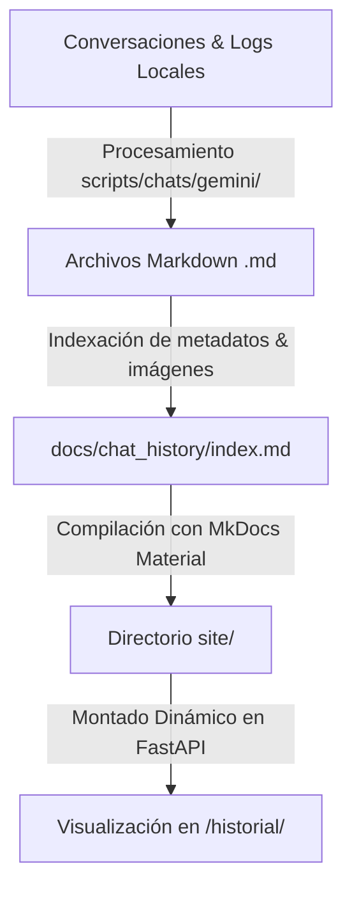

# 🕒 ChronoAPI — Portal de Servicios de Tiempo y Auto-Documentación

¡Bienvenido a **ChronoAPI**! Un ecosistema moderno y de alto rendimiento diseñado en Python con **FastAPI** que sirve servicios de fecha/hora del sistema en tiempo real. Cuenta con un dashboard web interactivo con diseño *glassmorphism* de última generación y un sistema de auto-documentación automática para compilar y visualizar el historial de pláticas/pair programming del desarrollo.

---

## 🚀 Características Destacadas

* **⚡ API de Alto Rendimiento:** Endpoints súper veloces basados en FastAPI que exponen la fecha, hora y marcas de tiempo del sistema de manera estructurada en JSON.
* **🎨 Dashboard Web Premium:** Interfaz web interactiva (`/`) diseñada con estética de alta gama:
  * Efectos de vidrio (*glassmorphism*) y fondos difuminados dinámicos con luces de neon flotantes.
  * Tipografía premium cargada desde Google Fonts (*Outfit* para la interfaz y *Fira Code* para bloques de datos).
  * Selector interactivo que permite consultar cada endpoint y ver de forma inmediata el valor formateado y el JSON de respuesta crudo.
  * Diseño móvil totalmente responsivo con animaciones suaves.
* **📖 Documentación de APIs por Duplicado:** Acceso inmediato a documentación técnica autogenerada e interactiva a través de **Swagger UI** (`/docs`) y **ReDoc** (`/redoc`).
* **💬 Ecosistema de Auto-Documentación de Chats:** Un sistema automatizado único en Python que extrae el historial de conversaciones y archivos multimedia de pair programming con el asistente IA (Antigravity), los convierte a artículos Markdown impecables, los integra a un sitio estático estructurado con **MkDocs (Material Theme)** y los sirve directamente desde el backend de FastAPI bajo la ruta `/historial/`.

---

## 📂 Estructura del Proyecto

El proyecto está diseñado bajo una arquitectura limpia y organizada en componentes especializados:

```text
ChronoAPI/
├── backend/                  # Código fuente del servidor web FastAPI
│   ├── templates/            # Vistas y plantillas HTML (Dashboard interactivo)
│   ├── .venv/                # Entorno virtual local (aislado)
│   ├── main.py               # Punto de entrada y definición de endpoints
│   └── requirements.txt      # Dependencias del backend y documentación
├── docs/                     # Archivos fuente de documentación en Markdown
│   ├── chat_history/         # Historial de chats exportado (conversaciones .md)
│   │   ├── images/           # Capturas e imágenes embebidas en los chats
│   │   └── index.md          # Índice cronológico y metadatos de las pláticas
│   ├── plan/                 # Planificación e hitos de arquitectura
│   └── walkthrough.md        # Bitácora detallada de cambios y reorganización
├── scripts/                  # Scripts utilitarios y automatizaciones
│   ├── backend/              # Scripts de instalación y ejecución por SO
│   │   ├── mac/              # Ejecutables para macOS/Linux (.sh)
│   │   └── win/              # Ejecutables para Windows (.bat)
│   └── chats/                # Lógica del procesador de conversaciones
│       └── gemini/           # Script exportador y formateador de transcripts
├── mkdocs.yml                # Configuración del compilador de documentación MkDocs
├── site/                     # Sitio estático generado por MkDocs (servido en /historial)
└── README.md                 # Este archivo informativo
```

---

## 🛠️ Requisitos Previos

Asegúrate de contar con lo siguiente en tu sistema antes de proceder:

* **Python 3.8 o superior** (verificable con `python3 --version` o `python --version`).
* **Acceso a una consola terminal** con privilegios de ejecución de scripts.

---

## 💻 Guía de Instalación y Ejecución

El proyecto incluye scripts automatizados para preparar el entorno virtual, instalar dependencias, ejecutar el servidor y compilar la documentación tanto en **macOS/Linux** como en **Windows**.

### 🍏 En macOS y Linux (Consola Bash/Zsh)

#### 1. Crear Entorno Virtual e Instalar Dependencias (macOS/Linux)

Ejecuta el script de inicialización para construir el entorno virtual `.venv` e instalar todas las dependencias requeridas (FastAPI, Uvicorn, MkDocs, etc.):

```bash
bash scripts/backend/mac/venv.sh
```

#### 2. Iniciar el Servidor de Desarrollo (macOS/Linux)

Lanza el servidor local en modo recarga automática. Uvicorn comenzará a escuchar en `http://127.0.0.1:8000`:

```bash
bash scripts/backend/mac/run.sh
```

#### 3. Exportar Chats y Compilar la Documentación (macOS/Linux)

Para sincronizar las últimas pláticas con el asistente, procesar las imágenes e indexar todo dentro de la compilación de MkDocs, ejecuta:

```bash
bash scripts/backend/mac/export.sh
```

#### 4. 💡 Atajos y Alias de Terminal (macOS/Linux)

Puedes cargar alias en tu sesión actual de terminal ejecutando `source` sobre el script `alias.sh`:

```bash
source scripts/backend/mac/alias.sh
```

Esto habilitará los siguientes comandos rápidos en tu terminal:

* `CA_install` — Equivale a ejecutar `venv.sh` (instalador).
* `CA_run` — Equivale a ejecutar `run.sh` (iniciar servidor).
* `CA_export` — Equivale a ejecutar `export.sh` (sincronizar historial de chats y MkDocs).

---

### 💻 En Windows (PowerShell / Command Prompt)

#### 1. Crear Entorno Virtual e Instalar Dependencias (Windows)

Abre tu consola de comandos en la raíz del proyecto y ejecuta:

```cmd
scripts\backend\win\venv.bat
```

#### 2. Iniciar el Servidor de Desarrollo (Windows)

Inicia el servidor local de FastAPI con recarga en tiempo real:

```cmd
scripts\backend\win\run.bat
```

#### 3. Exportar Chats y Compilar la Documentación (Windows)

Para actualizar la documentación y regenerar los chats compilados estáticos:

```cmd
scripts\backend\win\export.bat
```

#### 4. 💡 Atajos y Alias (Windows)

Para habilitar macros de consola útiles durante el desarrollo de ChronoAPI en tu sesión de CMD, ejecuta:

```cmd
scripts\backend\win\alias.bat
```

---

## 🔍 Explicación de Características Técnicas

### 1. Pruebas de Endpoints de FastAPI (`/api/*`)

El backend de ChronoAPI expone tres endpoints principales bajo la clasificación de **Servicios de Tiempo**. Estos endpoints están diseñados bajo los estándares REST y retornan respuestas con formato puramente JSON:

* **`GET /api/date`**: Retorna la fecha actual del sistema formateada estrictamente como `YYYY-MM-DD`.
  * *Ejemplo de respuesta:* `{"date": "2026-05-23"}`
* **`GET /api/time`**: Retorna la hora actual del sistema formateada estrictamente como `HH:MM:SS`.
  * *Ejemplo de respuesta:* `{"time": "23:09:17"}`
* **`GET /api/timestamp`**: Retorna una marca de tiempo completa que integra fecha y hora formateadas exactamente como `YYYY-MM-DD HH:MM:SS`.
  * *Ejemplo de respuesta:* `{"timestamp": "2026-05-23 23:09:17"}`

#### 🧪 ¿Cómo probar los Endpoints?

1. **Dashboard Glassmorphism (`/`)**: En la pantalla principal, los botones interactivos permiten hacer consultas asíncronas (`fetch`) en tiempo real directamente al servidor y ver cómo responde.
1. **Línea de Comandos (`curl`)**: Puedes realizar consultas usando cualquier cliente de terminal o HTTP:

   ```bash
   curl http://127.0.0.1:8000/api/timestamp
   ```

1. **Swagger UI Interactiva**: Accede a `http://127.0.0.1:8000/docs`, expande el endpoint deseado, haz clic en **"Try it out"** y luego en **"Execute"**. Podrás ver los códigos de estado HTTP (por ejemplo, `200 OK`), cabeceras de respuesta y la estructura del JSON en vivo.

---

### 2. Documentación de las APIs (Swagger y ReDoc)

FastAPI integra por defecto la generación de esquemas OpenAPI. En ChronoAPI, se configuró y optimizó esta característica para ofrecer dos portales de documentación interactiva de primer nivel:

* **Swagger UI (`/docs`)**:
  * **Propósito:** Ofrecer un entorno de prueba interactivo de caja de arena (*sandbox*).
  * **Características:** Agrupación visual por tags (ej. *Servicios de Tiempo*), esquemas de datos interactivos generados mediante Pydantic y botón directo para simular peticiones HTTP en tiempo real directamente desde el navegador.
  * **Enlace Cruzado:** La descripción de la cabecera incluye un link directo para saltar en un clic a ReDoc si se prefiere una lectura más limpia.
* **ReDoc (`/redoc`)**:
  * **Propósito:** Brindar una vista estructurada y elegante de especificación técnica, ideal para la integración de desarrolladores externos o publicación en entornos productivos.
  * **Características:** Navegación fluida en tres columnas (Menú de navegación izquierdo, Especificación de endpoints central, y Ejemplos de código/estructuras JSON en el panel derecho).

---

### 3. Documentación del Historial de Chats (`/historial`)

Una de las características más singulares y potentes del proyecto es su portal integrado de **Historial de Conversaciones**. A medida que interactúas con los asistentes de IA para codificar y ampliar este sistema, los registros del proceso se conservan de forma transparente y estructurada.



#### 🛠️ ¿Cómo funciona este Ecosistema?

1. **Extracción de Transcripts:** El script `export_conversations.py` lee directamente las bitácoras crudas locales del asistente en formato JSONL.
1. **Procesamiento de Contenido e Imágenes:** El script filtra la sesión actual y anteriores, analiza las interacciones de pair programming, extrae metadatos (como el modelo de IA usado, fecha, cuenta y sistema operativo de origen), descarga/copia los archivos multimedia adjuntos (guardándolos en `docs/chat_history/images/`) y escribe cada chat en un archivo Markdown independiente.
1. **Generación Dinámica de TOC (Tabla de Contenidos):** El exportador reconstruye dinámicamente un archivo de índice (`docs/chat_history/index.md`) con una tabla cronológica impecable que detalla la cantidad de mensajes por plática, sistema operativo en el que se trabajó y herramientas de IA utilizadas.
1. **Compilación en HTML Premium (MkDocs + Material Theme):** Se ejecuta `mkdocs build`, el cual compila toda la documentación a un portal web estático y veloz optimizado con navegación instantánea, esquemas claro/oscuro integrados y cajas de alerta (*admonitions*).
1. **Montaje en el Servidor Web FastAPI:** A través de la clase `StaticFiles` de FastAPI, la carpeta compilada `/site` se monta de forma dinámica en la ruta `/historial/`:

   ```python
   app.mount("/historial", StaticFiles(directory=site_path, html=True), name="historial")
   ```

   Esto permite que cualquier usuario o desarrollador acceda a `http://127.0.0.1:8000/historial/` para revisar la bitácora completa de decisiones técnicas y el razonamiento del código fuente del proyecto directamente desde el servidor web en ejecución.

---

## 📄 Licencia

Este proyecto es de código abierto y está diseñado con propósitos educativos y demostrativos. Siéntete libre de clonarlo, modificarlo y adaptarlo a tus necesidades.

---
*Desarrollado con pasión, inteligencia artificial avanzada y un diseño visualmente extraordinario.* ✨
