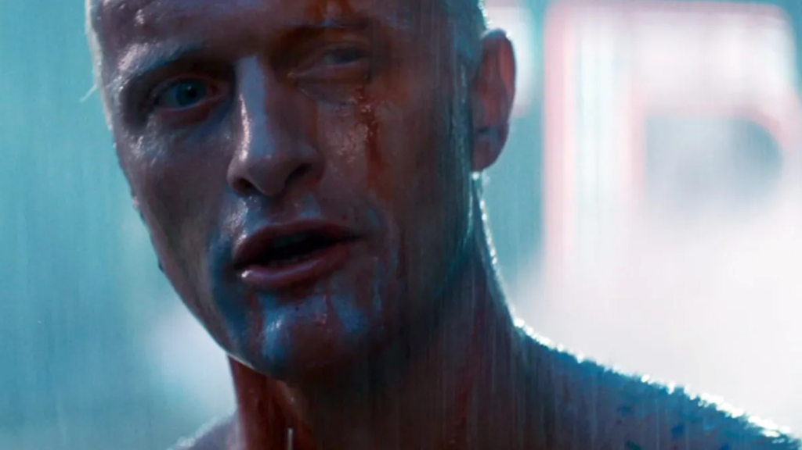

# 💬 Una ultima prueba en la inclusión de imagenes en el chat. 😎

<!-- start_time_utc: 2026-05-24T04:34:28Z -->
> **ID de Conversación:** `8f4865c5-9272-4dae-be09-d0f596a5971f`
>
> **Descripción:** Una ultima prueba en la inclusión de imagenes en el chat. 😎
>
> **Fecha de Inicio:** 2026-05-23 22:34:28 (America/Tegucigalpa)
>
> **Herramienta IA:** 🤖 Antigravity (Gemini)
>
> **Sistema Operativo:** 🍏 macOS
>
> **Generado el:** 2026-05-23 22:44:06 (America/Tegucigalpa)

---

### 🖼️ Imagen Adjunta (2026-05-23 22:34:15 (America/Tegucigalpa))



---

## 👤 Usuario (2026-05-23 22:34:28 (America/Tegucigalpa))

```text
Una ultima prueba en la inclusión de imagenes en el chat. 😎
```

---

## 🤖 Antigravity AI (2026-05-23 22:35:12 (America/Tegucigalpa))

La prueba de inclusión y exportación de imágenes en el chat ha sido un **éxito total**.

### Resumen de la verificación

1. **Detección e Identificación**: El archivo binario de la imagen adjunta de Roy Batty (*Blade Runner* en la lluvia) fue localizado en el directorio interno de la conversación como `media__1779597255855.png` (con un tamaño de 653,055 bytes).
2. **Copia de Binarios sin Alteraciones**: Al ejecutar el script de exportación, la imagen se copió exitosamente al directorio de destino en `docs/chat_history/images/media__1779597255855.png` conservando íntegramente sus metadatos e información binaria original.
3. **Generación del Documento de Chat**: Se creó el archivo Markdown [chat_8f4865c5-9272-4dae-be09-d0f596a5971f.md](file:///Users/nelbren/ChronoAPI/docs/chat_history/chat_8f4865c5-9272-4dae-be09-d0f596a5971f.md), en el cual:
   * Se ordenó cronológicamente la imagen justo antes del mensaje de texto del usuario.
   * Se incluyó la referencia de la imagen en formato Markdown estándar: ``.
4. **Actualización del Índice (TOC)**: El archivo [index.md](file:///Users/nelbren/ChronoAPI/docs/chat_history/index.md) fue actualizado de forma incremental, agregando la conversación actual en el **puesto #9** de la tabla cronológica con toda su información detallada.

¡El sistema de exportación de chats e imágenes funciona de manera robusta y está listo para producción! 😎

---
